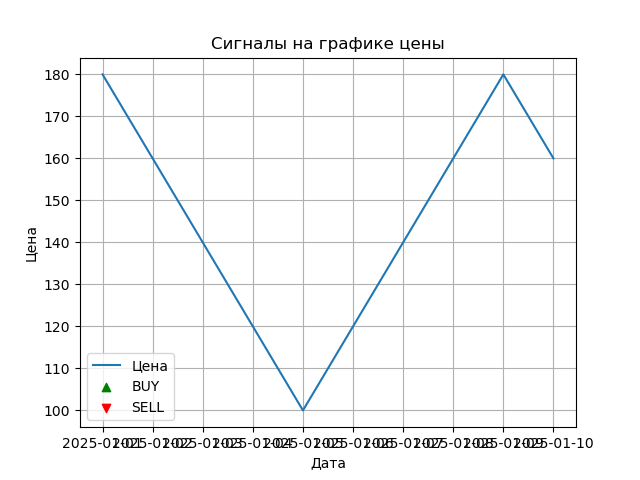

# 📈 Quant Signal Strategy: EMA + RSI + Supertrend



## 🧠 Overview

This project is a **Quantitative Trading Signal Generator** using:
- **Exponential Moving Average (EMA)**
- **Relative Strength Index (RSI)**
- **Supertrend**

The goal is to combine these popular indicators into a simple **Buy / Sell / Hold** signal engine in Python.  
This is **Project 1 of a 5-part quant portfolio** series by **Opticode**.

---

## 📂 Files Included

| File | Description |
|------|-------------|
| `strategy.py` | Core logic for combining indicators and generating trading signals |
| `indicators.py` | Functions to compute EMA, RSI, and Supertrend |
| `signals.py` | Unified signal decision engine |
| `plot_signals.py` | Plots price with BUY/SELL markers |
| `test_signals.py` | Prints signal (BUY/SELL/HOLD) from current data |
| `sample_data.csv` | Raw price data used for testing |
| `signal_plot.png` | Visualization of signals on price chart |

---

## 🚀 How to Run

```bash
# Run the test script to see the current signal
python test_signals.py

# Plot the signal chart
python plot_signals.py
```

---

## 📌 Author

**Opticode** – aspiring quant & Python developer.  
[GitHub Portfolio](https://github.com/LEGAL3529)

